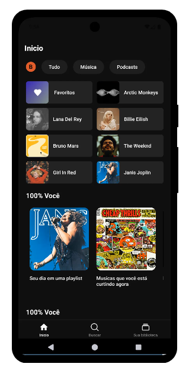
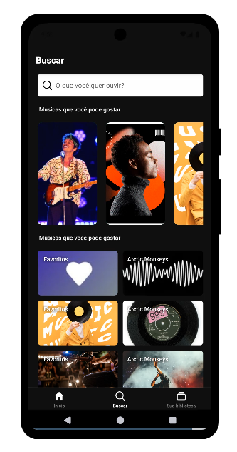
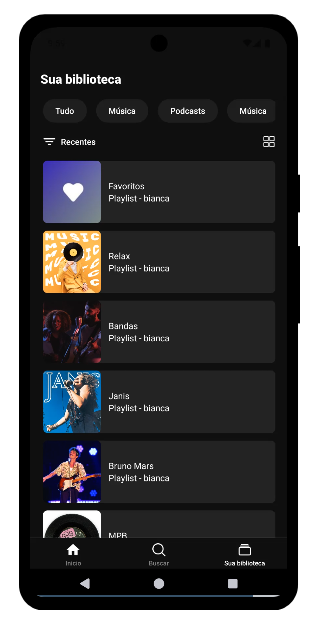

## Clone Spotify

Este é um clone do aplicativo Spotify desenvolvido com React Native. O projeto utiliza `react-navigation` com `TabScreen` para navegação entre telas, proporcionando uma experiência similar ao app original.

### Tecnologias Utilizadas
- React Native
- React Navigation
- Expo (opcional, dependendo da configuração do projeto)
- Styled Components (para estilização)

### Funcionalidades
- Navegação por abas utilizando `TabScreen`
- Tela inicial com sugestões de músicas e playlists
- Tela de pesquisa para encontrar músicas, artistas e álbuns
- Tela de biblioteca com listas salvas pelo usuário

---

Este projeto foi feito para fins educativos e não tem relação oficial com o Spotify.